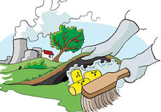

Palermo
=======

Palermo est un jeu de gestion sur le thème du traitement des déchets.



Vous êtes un industriel du traitement des déchets (décharges,
incinération, recyclage ...). Gérez au mieux vos moyens industriels, et
soyez le premier à saisir les contrats publics. Qui deviendra le plus
riche ?

Règles du jeu
-------------

Les règles du jeu (en développement) sont disponibles en ligne en suivant ce lien :
[./src/main/asciidoc/Palermo](./src/main/asciidoc/Palermo.adoc).

Print-n-Play
------------

Il n'existe à l'heure actuelle pas de fichier permettant de directement confectionner
soi-même un exemplaire du jeu.
(Mais les annexes des règles décrivent tout le matériel nécessaire.)

Informations techniques
-----------------------

Il est possible de générer une version transportable (HTML ou PDF) du livret de règles en suivant ces instructions :

**Prérequis:**

- [Maven](http://maven.apache.org/)
    - dernière version testée : Maven 3.5.4
    - (mais des versions plus anciennes devraient fonctionner également)

- Et donc aussi un [JDK](http://jdk.java.net/)
    - n'importe quelle version >= 1.7 peut faire l'affaire
    - (les versions >= 9 provoquent des warnings)

**Instructions:**

```sh
git clone https://github.com/arnauldvm/bg-palermo.git
cd bg-palermo
mvn -Pbackend-html
mvn -Pbackend-pdf
```

Ces commandes génèreront dans le répertoire `./target/generated-docs` un fichier `Palermo.html` et un fichier `Palermo.pdf` qui reprennent chacun l'ensemble des règles. (Les autres fichiers sont des extraits, de chapitres et sous-chapitres.)